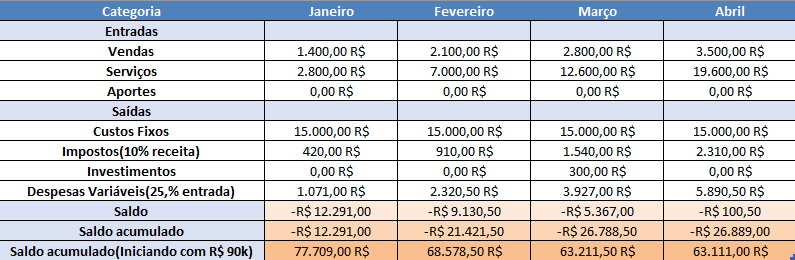

# 📌 App de serviço para hotel
# Hospfy

Nosso aplicativo revoluciona a forma de se hospedar em hotéis: em vez de ligar para a recepção, você pode solicitar serviços, fazer pedidos e agendamentos diretamente pelo aplicativo, de forma simples, rápida e prática.

---

## 👥 Integrantes

- Matheus Eduardo Silva – RA:1460282  
- Vinícius Dias Oliveira – RA: 1455187
- Luis Ricardo Cardoso – RA: 1464043  

---


## 📝  [PNBOX](https://pnbox.sebrae.com.br/planoNegocio/invite/m3-wy4c6o)


---

## 🧭 Etapas do Projeto

### 1️⃣ Definição do Problema e da Solução
- **Problema identificado:**  Hóspedes de hotéis enfrentam dificuldades em solicitar serviços, obter informações rápidas e manter uma comunicação eficiente com a recepção e funcionários. Além disso, os funcionários encontram desafios em gerenciar múltiplas solicitações ao mesmo tempo, acompanhar o andamento de cada pedido e responder de forma organizada.
 
- **Público-alvo:**  - Hóspedes de hotéis que desejam praticidade para solicitar serviços, obter informações e se comunicar de forma rápida com a recepção. Funcionários e equipe do hotel que precisam de uma ferramenta eficiente para gerenciar solicitações, organizar tarefas e manter a comunicação com os hóspedes. Gestores de hotéis interessados em otimizar a experiência do cliente e melhorar a eficiência operacional.
 
- **Impacto esperado:**  O projeto tem como impacto esperado a melhoria significativa na experiência do hóspede, oferecendo praticidade e rapidez no atendimento às suas necessidades. Além disso, busca otimizar a comunicação entre hóspedes e funcionários, reduzindo falhas e atrasos nos processos de solicitação. Para a equipe do hotel, espera-se um aumento da eficiência operacional por meio de um sistema que organiza e centraliza as demandas. De forma geral, o aplicativo também contribui para o fortalecimento da imagem do hotel, transmitindo modernidade, organização e inovação.
 
- **Solução proposta:**  Criar um aplicativo móvel que conecte hóspedes e funcionários em um único ambiente digital. O app permitirá aos hóspedes realizar solicitações de serviços, acessar um guia digital do hotel, enviar feedbacks e conversar com a recepção em tempo real. Para os funcionários, o sistema oferecerá um painel de controle para gerenciar solicitações, atualizar status e responder diretamente aos hóspedes.

### 2️⃣ Lean Canvas / Missão, Visão e Valores

- Lean Canvas (imagem ou link)  
- Missão: Facilitar a comunicação e a gestão de solicitações em hotéis, oferecendo agilidade, conforto e eficiência para hóspedes e funcionários.

- Visão: Ser a solução digital líder para comunicação e serviços em hotéis, reconhecida pela inovação e excelência na experiência do usuário.

- Valores: 
- Agilidade no atendimento
- Transparência na comunicação
- Foco no cliente
- Inovação constante
- Qualidade e confiabilidade


### 3️⃣ Custos e Tributos (Plano de Negócios - PNBOX)

### Custos Fixos
- **Hospedagem/servidor em nuvem:** R$ 500/mês
- **Licenças e APIs do sistema:** R$ 800/mês
- **Contabilidade e tributos:** R$ 200/mês
- **Marketing digital recorrente:** R$ 500/mês
- **Equipe mínima (desenvolvedor + suporte):** R$ 6.540/mês

### Custos Variáveis
- **Taxas de pagamento online (cartão, Pix):** 2% a 5% sobre a receita
- **Suporte técnico extra por hotel:** R$ 50/hotel/mês
- **Marketing de aquisição por cliente:** R$ 50/hotel

 ### Tributos aplicáveis
- **Alíquota média inicial:** ~6% sobre o faturamento 

### 4️⃣ Investimentos e Precificação
### Investimento inicial:
- **Investimento Fixo (Equipamentos):** R$ 18.000,00
- **Investimento Pré-operacional (Custos de Legalização e Marca):** R$ 4.100,00 
- **reserva financeira** de **R$ 10.000,00

## Estratégia de precificação:
 A estratégia de precificação do Hospfy é baseada em um modelo misto com planos por perfil de cliente, garantindo flexibilidade e escalabilidade.
- **Plano Básico:** R$ 400,00/mês
- **Plano Profissional:** R$ 700,00/mês
- **Plano Enterprise:** R$ 1.200,00/ano 

### 5️⃣ SWOT (Análise de Ambientes)

**Forças:**
* Custos operacionais baixos e estrutura enxuta.
* Planos acessíveis e gestão orientada por métricas.
* Estrutura legal e tributária simplificada.

**Fraquezas:**
* Baixo capital de giro e pouca capacidade de investimento.
* Marca nova no mercado e sem credibilidade inicial.
* Precificação do plano Enterprise desalinhada ao público-alvo.

**Oportunidades:**
* Crescimento da digitalização no setor hoteleiro.
* Nicho de pequenos e médios hotéis com poucas soluções adequadas.
* Demanda por plataformas simples com suporte humanizado.

**Ameaças:**
* Concorrência consolidada com mais recursos financeiros.
* Alta resistência e custo para o cliente trocar de sistema.
* Dependência de fatores externos como o desempenho do turismo e das OTAs (Agências de Viagem Online).

### 6️⃣ Planejamento Estratégico (BSC)
- Objetivos estratégicos:  
- Indicadores e metas:  
- Ações planejadas:  

### 7️⃣ Fluxo de Caixa


* Ponto de Equilíbrio (Break-Even): Atingido. A simulação prova que a empresa, com um crescimento de clientes projetado, cobre todos os seus custos fixos e variáveis (atingindo R$ 23.100,00 em receita vs. R$ 23.200,50 em custos) e fica proximo ao ponto de equilíbrio operacional no Mês 4 (Abril).

* Validação do Capital (Runway): O aporte inicial de R$ 90.000,00 (Reserva Financeira) foi validado.

* Saúde Final do Caixa: O déficit operacional total (cash burn) acumulado para atingir o equilíbrio foi de R$ 26.889,00. Ao subtrair esse valor do aporte inicial, a empresa conclui o período com um saldo de caixa final de R$ 63.111,00, garantindo um "fôlego" robusto para a próxima fase de crescimento.  

### 8️⃣ Valuation
- O FCD foi o método escolhido por ser o único que avalia o potencial de crescimento futuro (projeção de receita), que é o principal ativo do Hospfy, em vez de se basear em ativos físicos ou comparações de mercado que não se aplicam a uma startup em estágio inicial.  
- Valor estimado: R$ 5.108.869 (R$ 5,1 milhões)

### 9️⃣ Segurança Cibernética
- Riscos identificados:  
- Medidas de segurança:  

---

## 📅 Diário de Bordo

| Data       | Conteúdo/Etapa                     | Status     | Observações |
|------------|------------------------------------|------------|-------------|
| 06/08/2025 | Apresentação Disciplina + Start    | ✅ Concluído | — |
| 13/08/2025 | Definição dos Grupos e Propostas   | 🚧 Em andamento | Ajustar proposta com feedback do professor |

---

## 📦 Entregas

| Entrega                                | Data       | Descrição                                                         | Status |
|----------------------------------------|------------|-------------------------------------------------------------------|--------|
| Lean Canvas                            | 20/08/2025 | Documento e imagem do canvas                                      | —      |
| Custos e Tributos                      | 27/08/2025 | Planilha com custos fixos, variáveis e tributos                   | —      |
| Análise SWOT / Plano de Negócios       | 24/09/2025 | Análise de ambientes SWOT e entrega do Plano de Negócios          | —      |
| Fluxo de Caixa / Planejamento Estratégico | 15/10/2025 | Planilha de fluxo de caixa e entrega do Planejamento Estratégico  | —      |
| Valuation                              | 05/11/2025 | Relatório com cálculo de valuation                                | —      |
| Valuation      | 12/11/2025 | Valuation | —      |

---

## 🗣️ Feedbacks Recebidos

| Data       | De Quem     | Feedback                                                        | Ação Tomada |
|------------|-------------|----------------------------------------------------------------|-------------|
| 24/09/2025 | Professor X | Melhorar clareza da análise SWOT                                | Revisão feita |

---

## 📚 Lições Aprendidas
- O que a equipe aprendeu durante cada fase.  

---

## 📁 Organização do Repositório

```
📦 projeto/
 ┣ 📂 docs/
 ┃ ┣ lean_canvas.png
 ┃ ┣ custos_tributos.xlsx
 ┃ ┣ swot_plano_negocios.pdf
 ┃ ┣ fluxo_caixa_planejamento.xlsx
 ┃ ┗ valuation.pdf
 ┣ 📂 src/
 ┃ ┣ prototipo/
 ┃ ┗ documentos_planejamento/
 ┣ README.md
```

---
